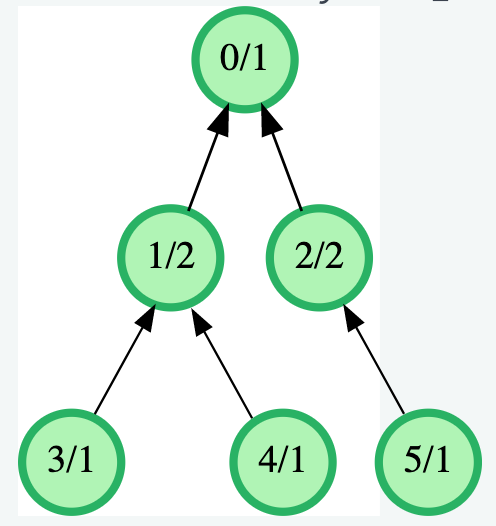
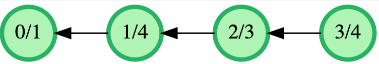
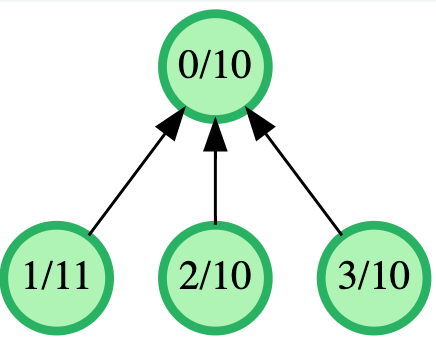

# 2. Balanced System Files Partition


The directory structure of a system disk partition is represented as a tree. Its n directories are numbered from 0 to n-1, where the root directory has the number 0. The structure of the tree is defined by a parent array, where parent[i] = j means that the directory i is a direct subdirectory of j. Since the root directory does not have a parent, it will be represented as a parent[0] = -1. The value in files_size[i] denotes the sum of the sizes in kilobytes of the files located in directory i, but excluding its subdirectories. The size of the content of a directory is defined as the size of all of its subdirectories. Partition the tree into two smaller ones by cutting one branch so that the sizes of the resulting subtrees are as close as possible.

## Example
parent = [-1,0,0,1,1,2]
files_size = [1,2,2,1,1,1]

The structure of the system is shown in the diagram below. The nodes are labeled as <directory>/<file_size>.



Cut the branches between directories 1 and 0.
The partition {0,2,5} has size files_size[0] + files_size[2] + files_size[5] = 1 + 2 + 1 = 4.
The partition {1,3,4} has size files_size[1] + files_size[3] + files_size[4] = 2 + 1 + 1 = 4.
The absolute difference between the sizes of the two new trees is 4 - 4 = 0.
Since no other partition can have a smaller absolute difference, the final answer is 0.

## Function Description
Complete the function mostBalancedPartition in the editor below.

The function has the following parameter(s):
int parent[n]: each parent[i] is the parent directory of directory i
int files_size[n]: each file_sizes[i] is the sum of file sizes in directory i

## Returns
int: the minimum absolute difference in the size of content between two subtrees

## Constraints
2 <= n <= 10^5
1 <= files_size[i] <= 10^4
parent[0] = -1
parent[i] < i for 1 <= i < n
The depth of each directory tree is at most 500.

## Sample Input
```
parent = [-1,0,1,2]
files_size = [1,4,3,4]
```

## Sample Output
```
2
```

## Explanation
The structure of the system is shown in the diagram below.



Cut the branch between directories 1 and 2. This will result in partitions {0,1} with size 1 + 4 = 5 and {2,3} with size 3 + 4 = 7. The absolute difference between their sizes is |5 - 7| = 2

## Sample Input
```
parent = [-1,0,0,0]
files_size = [10,11,10,10]
```

## Sample Output
```
19
```

## Explanation
The structure of the system is shown in the diagram below.



Cut the branch between directories 0 and 1. This will result in partitions {0,2,3} with size 10 + 10 + 10 = 30 and {1} with size 11. The absolute difference between their sizes is |30 - 11| = 19

## Sample Input
```
parent = [ -1, 0, 1, 2, 1, 0, 5, 2, 0, 0 ]
files_size = [ 8475, 6038, 8072, 7298, 5363, 9732, 3786, 5521, 8295, 6186 ]
```

## Sample Output
```
4182
```

## Sample Input
```
parent = [ -1, 0, 0, 0, 0, 3, 4, 6, 0, 3 ]
files_size = [ 298, 2187, 5054, 266, 1989, 6499, 5450, 2205, 5893, 8095 ]
```

## Sample Output
```
8216
```